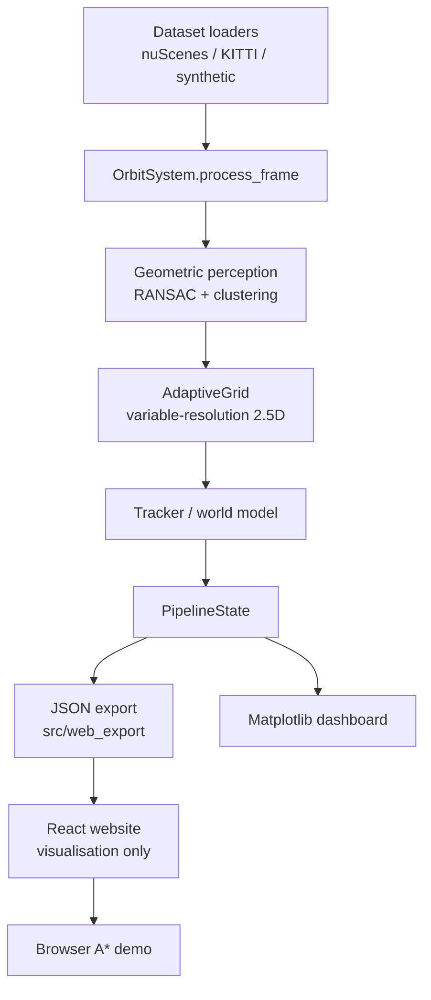

# ORBIT

**Adaptive Variable-Resolution 2.5D LiDAR Mapping for Dynamic Environment Perception**

A prototype / proof-of-concept toward the intended **DRDO / iDEX** Smart Vehicles system.

> This repository is prepared for NSUT internal SIH review. It is **not** a completed production autonomy stack. PointNet++ and Sparse CNN perception are **planned future work** and are **not implemented**.

---

## Table of contents

1. [Problem statement](#problem-statement)
2. [Overview](#overview)
3. [Key features](#key-features)
4. [System architecture](#system-architecture)
5. [Adaptive / foveated 2.5D representation](#adaptive--foveated-25d-representation)
6. [Datasets](#datasets)
7. [Web visualization](#web-visualization)
8. [Path planning demonstration](#path-planning-demonstration)
9. [Exported metrics](#exported-metrics)
10. [Technology stack](#technology-stack)
11. [Project structure](#project-structure)
12. [Installation / running locally](#installation--running-locally)
13. [Screenshots / demo](#screenshots--demo)
14. [Documentation](#documentation)
15. [Future work](#future-work)
16. [Prototype disclaimer](#prototype-disclaimer)

---

## Problem statement

**Title:** Adaptive Variable Resolution 2.5D Lidar Mapping for Dynamic Environment Perception

**Organization:** DRDO — Department of Defence Production / iDEX  
**Theme:** Smart Vehicles

Dense 3D LiDAR is rich but expensive to process; a flat 2D occupancy grid drops the height needed for curbs, potholes, terrain, and overhangs. The intended approach is **foveated mapping**: fine spatial detail near the vehicle, coarser cells farther away.

Official task directions:

1. **Terrain analysis** — distinguish drivable vs non-drivable surfaces.
2. **Object detection** — static obstacles and dynamic objects.
3. **Adaptive spatial representation** — non-uniform resolution without silently inventing geometry.

This prototype demonstrates the **adaptive 2.5D representation** and exported-data visualization. Learned semantic perception remains future work.

---

## Overview

```text
LiDAR-derived / exported environment data
        ↓
Adaptive variable-resolution 2.5D grid
        ↓
Elevation + geometric semantic layers (GROUND / MIXED / OBSTACLE)
        ↓
Tracked object footprints (exported tracks / world objects)
        ↓
Interactive web exploration
        ↓
Browser A* planning demonstration on exported occupancy
```

The Python pipeline (`src/`) builds the grid geometrically (RANSAC ground, range rings, clustering, tracking). The website (`web/`) **does not re-run perception**. It loads JSON exports of `PipelineState`.

---

## Key features

Implemented in this repository:

- Adaptive variable-resolution 2.5D mapping from LiDAR
- Elevation-aware cells (`ground_elevation`, `z_mean`, `z_min` / `z_max` where present)
- Geometric cell labels GROUND / MIXED / OBSTACLE (not a neural segmenter)
- Multi-dataset architecture: nuScenes, SemanticKITTI, ORBIT Synthetic
- Interactive Demo (`/demo`): LiDAR, world points, adaptive grid, objects
- 2.5D Map (`/map`): terrain / semantic / resolution / obstacle views, foveation overlay
- Tracked-object inspector from exported fields; optional object IDs
- Browser A* on exported occupancy (`/planning`): Start → Destination → Locate path → path playback
- Honest export metrics (counts and ratios only)
- Matplotlib Visual Intelligence dashboard (Python; separate from the website)

Not claimed: PointNet++, Sparse CNN, official FPS/latency/accuracy, live vehicle control.

---

## System architecture



**Future work (not in this diagram as implemented stages):** PointNet++, Sparse CNN, learned terrain/object classification, production runtime planner.

World coordinates are **LiDAR frame 0**, never nuScenes global.

---

## Adaptive / foveated 2.5D representation

ORBIT stores occupied space as cells whose **size comes from range rings in the Python mapper**. Fine cells carry higher spatial detail near the sensor; coarser cells cover farther ranges.

The website does **not** assume fixed 10 m / 100 m rings unless those extents exist in the **exported cells**. The map overlay draws ego and rings at the **actual max range of each exported resolution**.

Typical rings in `src/mapping/adaptive_grid.py` (Python, when that mapper ran):

| Ring | Horizontal range | Cell size |
|------|------------------|-----------|
| 0 | 0–10 m | 5 cm |
| 1 | 10–25 m | 10 cm |
| 2 | 25–50 m | 25 cm |
| 3 | 50–100 m | 50 cm |

Visualization legends always use the resolutions present in the current JSON.

---

## Datasets

| Dataset | Architecture | Typical export status |
|---------|--------------|------------------------|
| **nuScenes** | Scene collections (`scene-0061`, …) | Available when JSON is copied to `web/public/data/nuscenes/…` |
| **SemanticKITTI** | Sequence collections | Listed as *not exported yet* until JSON exists — the explorer will not invent a sequence |
| **ORBIT Synthetic** | Environment collections | Often a **one-frame** export with a large adaptive grid (visualization is subsampled) |

Registry: `web/public/data/datasets.json`. Frame dumps are gitignored; copy from `exported_data/` for local/demo deployments.

---

## Web visualization

| Route | Role |
|-------|------|
| `/` | Landing / problem framing |
| `/demo` | Interactive Demo — exported LiDAR, grid, objects |
| `/map` | Dedicated 2.5D adaptive grid explorer |
| `/planning` | Browser A* demonstration |
| `/pipeline`, `/about`, `/technology` | Honest system copy |

Colour language (consistent across pages):

- **Terrain / spatial data** — cool blue / cyan / teal
- **Obstacles** — warm orange / amber
- **Tracked objects** — distinct footprints; MOVING / STATIC colours only when `motion_state` is exported
- **Ego** — cyan cone
- **Path** — yellow polyline

---

## Path planning demonstration

```text
exported adaptive_cells + obstacle_cells
        ↓
occupancy graph (GROUND traversable; MIXED / OBSTACLE / obstacle_count blocked)
        ↓
Start → Destination → Locate path
        ↓
browser A* (only then)
        ↓
route polyline + playback if PATH FOUND
```

**This is a website planning demonstration using exported ORBIT environment data. It is not the production ORBIT runtime planner.** It is not live autonomous navigation or vehicle control.

---

## Exported metrics

Shown only when the underlying JSON fields exist:

| Metric | Source |
|--------|--------|
| Input points | `input_points` / `point_count_full` / `mapped_points` |
| Exported points | `point_count_exported` |
| Adaptive cells | metrics or array length |
| Point-to-cell ratio | input points ÷ cell count |
| Resolution levels | unique exported `resolution` values |
| Fine / coarse | counts at min and max unique resolutions |
| Live tracks | `live_tracks` or `tracks.length` |
| Frame index / exported frames | frame + manifest |

Not displayed: FPS, pipeline latency, classification accuracy, invented memory savings.

---

## Technology stack

| Layer | Technologies actually used |
|-------|----------------------------|
| Perception / mapping | Python 3, NumPy, Open3D, scikit-learn (DBSCAN sidecar), Matplotlib |
| Tests | pytest |
| Website | React, TypeScript, Vite, Tailwind CSS, Framer Motion, Three.js / R3F |
| Export | `python -m web_export.export_orbit_data` |

There is no `pyproject.toml`. `src/` is used via `PYTHONPATH=src`.

---

## Project structure

```text
ORBIT/
  README.md                 # this file
  requirements.txt
  docs/                     # architecture, development, website, datasets
  assets/
    screenshots/            # review screenshots of the working prototype
    presentation/           # PPT drop-in (placeholder until the file exists)
    demo-video/             # demo video drop-in (placeholder until the file exists)
  src/                      # Python prototype pipeline
    mapping/                # AdaptiveGrid
    perception/
    tracking/
    world_model/
    visualization/          # Matplotlib dashboard (do not replace)
    web_export/             # JSON exporter
    datasets/
  tests/
  web/                      # Vite + React visualisation client
    public/data/            # datasets.json + local JSON copies (mostly gitignored)
  exported_data/            # exporter output (JSON gitignored)
```

---

## Installation / running locally

### Python pipeline

```bash
python3 -m venv venv
source venv/bin/activate          # Windows: venv\Scripts\activate
pip install -r requirements.txt

mkdir -p data
PYTHONPATH=src python src/synthetic_scene.py

PYTHONPATH=src python -m pytest tests/
```

End-to-end (requires a dataset tree; see [docs/development.md](docs/development.md)):

```bash
PYTHONPATH=src python src/orbit_system.py --source kitti --sequence 00 --start 0 --end 9 --dashboard
```

Export for the website (example):

```bash
PYTHONPATH=src python -m web_export.export_orbit_data \
  --source nuscenes --scene scene-0061 --start 0 --end 19 \
  --output exported_data --max-points 5000

mkdir -p web/public/data/nuscenes/scene-0061
cp exported_data/scene-0061/*.json web/public/data/nuscenes/scene-0061/
```

### Website

```bash
cd web
npm install
npm run dev
```

Open:

- http://localhost:5173/
- http://localhost:5173/demo
- http://localhost:5173/map
- http://localhost:5173/planning

Production build:

```bash
cd web
npm run build
npm run preview
```

---

## Screenshots / demo

Real captures of this prototype (not mockups):

| Preview | File |
|---------|------|
| Landing | [assets/screenshots/01-landing.png](assets/screenshots/01-landing.png) |
| Interactive Demo | [assets/screenshots/02-interactive-demo.png](assets/screenshots/02-interactive-demo.png) |
| Adaptive grid map | [assets/screenshots/03-adaptive-grid-map.png](assets/screenshots/03-adaptive-grid-map.png) |
| Foveated / synthetic map | [assets/screenshots/04-synthetic-foveation.png](assets/screenshots/04-synthetic-foveation.png) |
| Path planning | [assets/screenshots/05-path-planning.png](assets/screenshots/05-path-planning.png) |

**Presentation (PPT)** and **demo video** are not fabricated here. Drop files into:

- [assets/presentation/](assets/presentation/README.md)
- [assets/demo-video/](assets/demo-video/README.md)

Do not invent YouTube, Drive, or Canva links.

---

## Documentation

| Document | Contents |
|----------|----------|
| [docs/project-context.md](docs/project-context.md) | Official statement vs current status |
| [docs/architecture.md](docs/architecture.md) | Current Python architecture |
| [docs/development.md](docs/development.md) | Commands, tests, conventions |
| [docs/web.md](docs/web.md) | Website phases and JSON mapping |
| [docs/dashboard.md](docs/dashboard.md) | Matplotlib dashboard |
| [docs/nuscenes.md](docs/nuscenes.md) | nuScenes adapter |
| [web/README.md](web/README.md) | Website-only run notes |

---

## Future work

- PointNet++ and Sparse CNN (or equivalent) learned LiDAR perception
- Learned semantic segmentation
- Learned terrain / drivable classification
- Learned static vs dynamic object classification
- Production Python runtime planner
- Live autonomous vehicle control
- Official latency / FPS evaluation
- Official memory benchmarking
- Classification accuracy protocols vs range

---

## Prototype disclaimer

ORBIT is a **prototype / proof-of-concept** developed under limited implementation time for the intended DRDO/iDEX problem.

The current implementation demonstrates an **adaptive variable-resolution 2.5D spatial representation** built from real LiDAR-derived / exported environment data, plus an honest visualization and planning **demonstration** client.

Deep learning semantic perception is **planned future work**. Do not read this README as a claim that PointNet++ or Sparse CNNs are in the tree.
